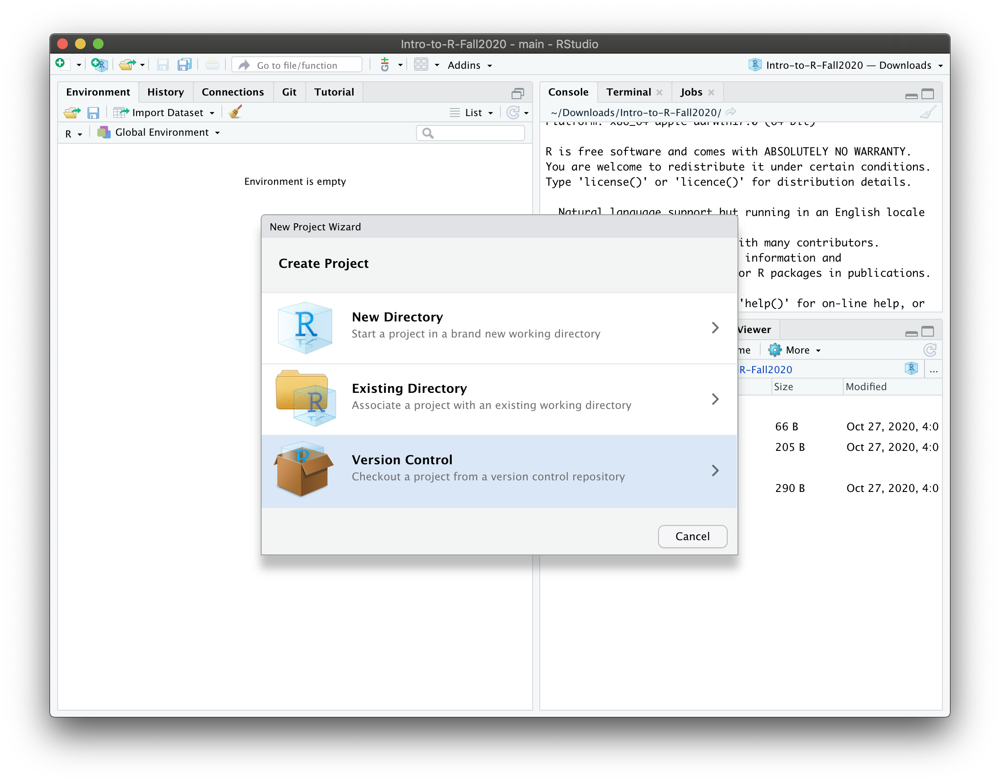
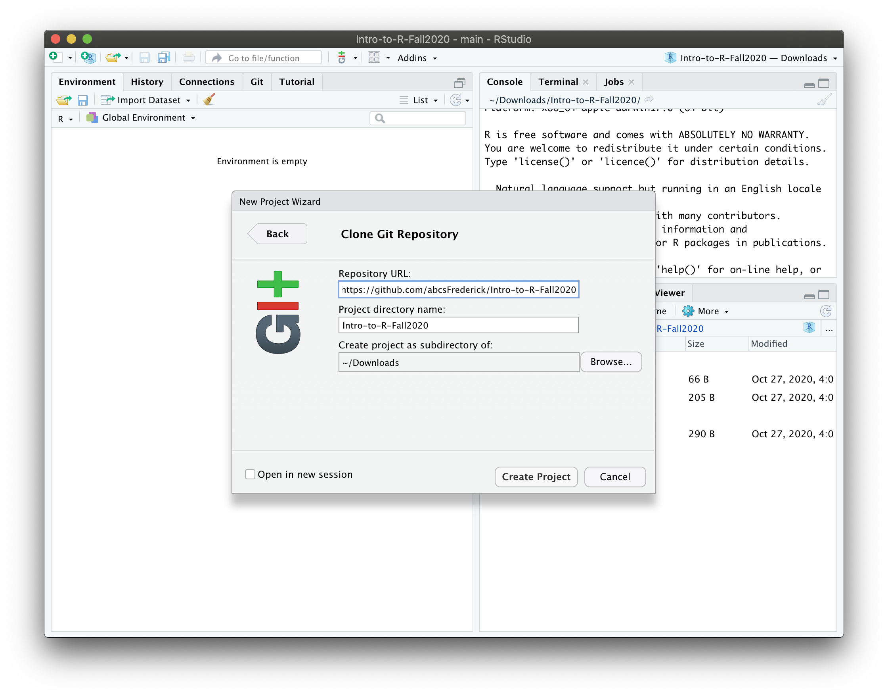

## Welcome to R for Reproducible Scientific Analysis

This course follows the [R for Reproducible Scientific Analysis](http://swcarpentry.github.io/r-novice-gapminder/) provided by the [Software Carpentry](https://software-carpentry.org/) community, with some minor modifications to meet current needs in the NCI community.

## Preparation

In preparation for this course, you should have installed [R](http://cran.rstudio.com/) and [RStudio](https://rstudio.com/products/rstudio/download/) (you may need admin privileges for this). You should also try to download the git repository for this workshop as follows (if you are using Windows, you may need to [install git](https://git-scm.com/download/win) before continuing):

-   Open RStudio and select File \> New Project...

-   Create using version control.

-   Select Git

-   Enter the repository URL (<https://github.com/abcsFrederick/Intro-to-R-Fall2020> ) and select a location to download it.

-   This should download and open the workshop repository. If it doesn't, you may need to update your git settings or [install git](https://git-scm.com/download/win) before continuing (you should only have to install git if working on a Windows machine).

    -   Mac OS X:

        -   Go RStudio -\> Preferences... -\> Git/SVN
        -   Check and see whether there is a path to a file in the "Git executable" window. If not, the next challenge is figuring out where Git is located.
        -   In the terminal enter `which git` and you will get a path to the git executable. In the "Git executable" window you may have difficulties finding the directory since OS X hides many of the operating system files. While the file selection window is open, pressing "Command-Shift-G" will pop up a text entry box where you will be able to type or paste in the full path to your git executable: e.g. "/usr/bin/git" or whatever else it might be.

    -   Windows:

        -   Go Tools -\> Global options... -\> Git/SVN
        -   'git.exe' might be installed at `C:/Program Files/Git/bin/git.exe`.

## Downloading updates

We will be making regular updates to the repository each week, including addition of the code we used during each session and the chat log. You'll want to download those into your copy of the repository. Luckily if you set it up following the instructions above, this is a realitvely easy task.

-   Open up your repository by opening the `Intro-to-R-Fall2020.Rproj` file. This will be located in the directory you created when you first downloaded the repository.

-   Next, you need to select Tools \> Version Control \> Pull Branches

-   RStudio should then automagically update your copy with updates from GitHub.

## If you don't have git

If you are having trouble getting git to work on your computer, you can download the repository directly from GitHub using [this link](https://github.com/abcsFrederick/Intro-to-R-Fall2020/archive/main.zip). You'll set up your RStudio project similarly as described above, but instead of picking "Version Control", unzip the repository and use the "Existing Directory" option.